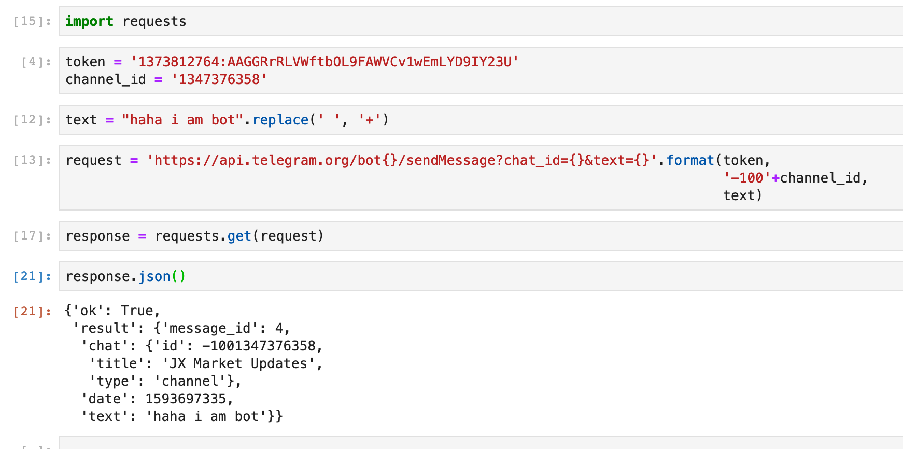

# Welcome to JX's telegram bot
This repo contains scripts to operate a Telegram bot which is used to gather and disseminate financial information via the Telegram messenger app.

The `telebot.ipynb` notebook that walks you through how the bot does its job. 

Scripts that power the bot is located in the `jx_telebot.py` file 

For this bot to work, you need to input your own bot's token and channel id under the ` class telegram_bot`.  

## Example
Sample of a message sent using this script

## Uses
- Coupling this with crontab allows you to schedule regular market updates delivered at the time of your choosing. 

## Caveats
- This project uses the Python `yfinance` library to gather financial information. All limitations of that library applies. 
- For live market information, the prices quoted are delayed by at least 15 min. 

## Further work 
- Develop interactive capabilities for the bot. Ideas include providing a ticker prompt for the bot to return live data or close prices of the ticker. 